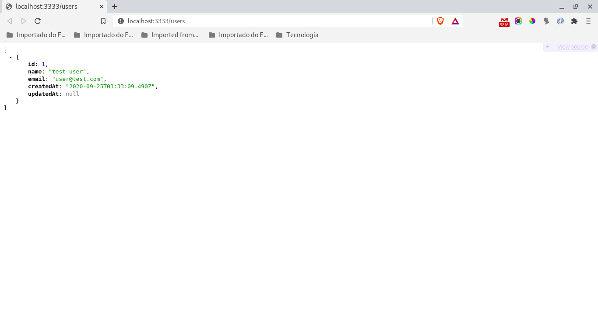

# **skeleton-node** #
Skeleton NodeJS-GraphQL-Postgres-MongoDB-Redis-Docker
<br /><br />

**Tabela de conteúdos**
=================
<!--ts-->
* [Descrição](#Descrição)
    * [Funcionalidades](#Funcionalidades)
    * [Arquitetura](#Arquitetura)
    * [Modelo de dados](#Modelo-de-dados)
* [Instalação](#Instalação)
    * [Pré Requisitos](#Pré-Requisitos)
    * [Clonando o projeto](#Clonando-o-projeto)
    * [Árvore de diretórios](#Árvore-de-diretórios)
    * [Atalhos de comandos](#Atalhos-de-comandos)
    * [Primeira execução](#Primeira-execução)
* [Utilização](#Utilização)
    * [Iniciar projeto](#Iniciar-projeto)
    * [Parar projeto](#Iniciar-projeto)
    * [Testar projeto](#Testar-projeto)
    * [Atualizar dependências](#Atualizar-dependências)
* [Desinstalação](#Desinstalação)
* [Tecnologias](#Tecnologias)
* [Referências](#Referências)
<!--te-->
<br />

## **Descrição** ##
Esse é um modelo inicial para desenvolvimento de **API's RESTful** que pode ser utilizado com **Docker** tendo como linguagem base o **NodeJS** acessando uma base relacional **Postgres** e bases não relacionais **MongoDB** e **Redis** via **GraphQL**. Na implementação com **Docker** é utilizada uma imagem **NodeJS-LTS** instalada em uma distribuição **GNU/Linux Alpine**.
<br /><br />

### **Funcionalidades** ###

- [x] Estrutura básica<br />
- [x] Dockerfile<br />
- [x] Docker-compose<br />
- [x] Atalhos de comandos com Make<br />
- [x] Imagem pequena com Alpine<br />
- [x] Padronização e estilização do código<br />
- [x] Utilização de variáveis de ambiente<br />
- [x] Persistência de dados em volume do Docker<br />
- [x] Restart automático dos serviços após alteração do código<br />
- [x] Implementação de ES6 em todo o código<br />
- [x] Validação de conteúdo postado<br />
- [x] Tratamento de erros e exceções<br />
- [x] ORM para persistência de dados<br />
- [x] Atalhos de comandos com Make<br />
- [x] Processo automático de instalação e desinstalação<br />
- [x] Atalho para atualização de dependências<br />
- [x] Atalho para visualização de logs com atualização automática<br />
- [x] Utilização de migrations e seeds<br />
- [ ] Ambiente gráfico integrado para teste dos serviços<br />
- [ ] Implementação de tipagem e OOP com Typescript<br />
- [ ] Path Mapping para imports<br />
- [ ] Testes unitários<br />
<br />

### **Arquitetura** ###
Foi desenvolvida uma arquitetura voltada para **microsserviços** com cada um deles separados em **containers Docker** que podem ser escalados mediante a demanda necessária. A estrutura básica foi desenvolvida em **NodeJS com Express**, ambos responsáveis pela gestão e roteamento das requisições **HTTP usando padrão REST**.
Foi criada uma pequena estrutura de dados relacionais com **Postgres** e não relacionais com **MongoDB** e **Redis**, sendo que a comunicação da camada de código com as bases de dados se faz através da abstração do **GraphQL**.
<br /><br />

### **Modelo de dados** ###


<br /><br />

## **Instalação** ##
O processo de instalação envolve basicamente a **clonagem desse projeto**  através do **Git** (ver abaixo) e a **execução de um simples comando**. Porém, para que tudo funcione adequadamente é fundamental que todos os **pré-requisitos** sejam atendidos integralmente.
<br /><br />

### **Pré-Requisitos** ###
Para que seja realizada a instalação, construção, execução e testes são necessárias as seguintes tecnologias previamente instaladas que devem ser verificadas através do **terminal  (Linux / MacOS)** ou **CommandShell/ CMD / PowerShell  (Windows)**:

- **Git**

    Para confirmar se já está instalado:<br />
    ```
    git --version
    ```

    Caso ainda não esteja instalado:<br />
    https://git-scm.com/book/pt-br/v2/Come%C3%A7ando-Instalando-o-Git
<br /><br />

- **Make**

    Para confirmar se já está instalado:<br />
    ```
    make --version
    ```

    Caso ainda não esteja instalado:<br />

    - **GNU/Linux**<br />
    ```
    sudo apt-get install build-essential
    ```

    - **Windows**<br />
    http://gnuwin32.sourceforge.net/packages/make.htm
    <br /><br />

- **Docker:**

    Para confirmar se já está instalado:<br />
    ```
    docker --version
    ```

    Caso ainda não esteja instalado:<br />
    https://www.docker.com/community-edition#/download


- **Docker-compose**:
    Normalmente, ao instalar o Docker, o Compose também é instalado. Por via das dúvidas, caso queira confirmar se já está instalado:<br />
    ```
    docker-compose --version
    ```

    Caso ainda não esteja instalado:<br />
    https://docs.docker.com/compose/install/
<br /><br />

### **Clonando o projeto** ###
Considerando que todos os passos descritos acima foram realizados, abrir o terminal e acessar o local onde deseja instalar o projeto, por exemplo, o **próprio diretório do usuário**:<br />
```
?>cd ~
```

Agora basta realizar o **clone** desse projeto através do **Git** no diretório atual com o nome do projeto desejado, por exemplo, ***novo-projeto***, ficaria assim:

```
?>git clone https://github.com/acgomes68/skeleton-node.git novo-projeto
```

Se tudo estiver OK, todos os arquivos do projeto serão baixados para o diretório /home/***seu-usuario***/novo-projeto, de modo que a estrutura fique como demonstrado abaixo.
<br /><br />

### **Árvore de diretórios** ###
```
├── node_modules
├── public
│   └── screenshots
├── src
│   ├── app
│   │   ├── controllers
│   │   │   └── UserController.js
│   │   └── models
│   │       └── User.js
│   ├── config
│   │   └── database.js
│   ├── database
│   │   ├── migrations
│   │   │   └── 20200828092516-create-users.js
│   │   ├── seeds
│   │   │   └── 20200901012052-basic-user.js
│   │   └── index.js
│   ├── app.js
│   ├── routes.js
│   └── server.js
├── .dockerignore
├── .editorconfig
├── .env
├── .env.example
├── .eslintrc.js
├── .gitignore
├── .prettierrc
├── .sequelizerc
├── docker-compose.yml
├── Dockerfile
├── Makefile
├── nodemon.json
├── package.json
├── README.md
└── yarn.lock
```
<br />

### **Atalhos de comandos** ###
Para facilitar a utilização foram criados alguns atalhos com as principais funcionalidades. Para ter acesso aos atalhos é necessário certificar-se que está no diretório raiz do projeto usando o comando abaixo no terminal:<br />
```
?>cd ~/novo-projeto
```

Desta feita, para listar todos os atalhos disponíveis executar:<br />
```
?>make help
```

Deve aparecer algo como a imagem abaixo.
```
usage: make COMMAND

Commands:
  clean      Drop database and clean dependencies
  help       Show this help screen
  install    Create and start containers, create database, run migrations and seeds
  logs       Watch log output
  restart    Restart all containers
  start      Start all containers
  status     Show containers current status
  stop       Stop all services
  test       Run eslint and application unit tests
  uninstall  Stop and clear all services
  update     Update Node dependencies with yarn
```
<br />

### **Primeira execução** ###
Através de qualquer editor de texto, atualizar as informações do arquivo **.env.example** que está na **raiz do projeto** e renomeá-lo para **.env.**. Exemplo:
```
# Node settings
NODE_ENV=development

# Application settings
APP_NAME=novo_projeto
APP_URL=http://localhost
APP_PORT=3333
APP_HOST=0.0.0.0

# PostgreSQL settings
POSTGRES_HOST=postgres
POSTGRES_USER=postgres
POSTGRES_PASSWD=docker
POSTGRES_DATABASE=novo_projeto
POSTGRES_PORT=5432
```
Após isso, conforme descrito no item anterior, através do **terminal** executar:<br />
```
?>make install
```
Após o final da instalação, acessar os serviços através do endpoint:<br />
http://localhost:3333/

Por exemplo, para o serviço users (instalado por padrão):<br />
http://localhost:3333/users

Esse passo pode ser realizado através do navegador, pelo ambiente gráfico de teste da API ou até mesmo pelo terminal através do comando **curl** caso possua o programa instalado.

**Visão do navegador**<br />


**Visão através do comando curl**<br />
```
?>curl http://localhost:3333/users
[{"id":1,"name":"test user","email":"user@test.com","createdAt":"2020-09-25T03:33:09.490Z","updatedAt":null}]%
```
<br />

## **Utilização** ##
A partir do momento que o projeto foi instalado ele é **automaticamente iniciado**.

### **Iniciar projeto** ###
Caso necessite **iniciar manualmente** o projeto, basta certificar-se que está no diretório raiz do projeto e executar no terminal:
```
?>make start
```
<br />

### **Parar projeto** ###
Caso necessite **parar manualmente** o projeto, basta certificar-se que está no diretório raiz do projeto e executar no terminal:
```
?>make stop
```
<br />

### **Testar projeto** ###
Para **garantir a execução** adequada antes de gerar um **build** para a **produção** é prudente que seja realizado um **teste automatizado** que envolve a **verificação do padrão de sintaxe e formatação**, além dos **testes unitários** e a **cobertura do código**. Para tal, basta certificar-se que está no diretório raiz do projeto e executar no terminal:
```
?>make test
```
<br />

### **Atualizar dependências** ###
Assim que o projeto é instalado, as dependências iniciais são as seguintes:
- Gerais
    - **cors**: autentidação no redirecionamento de domínio;
    - **dotenv**: leitura de variáveis de ambiente a partir de arquivo .env;
    - **express**: roteamento e manipulação HTTP para API REST;
    - **pg**: apoio na utilização do Postgres;
    - **sequelize**: persistência de dados para Postgres;
    - **shortid**: gerador de ids curtos;
    - **youch**: tratamento de erros e exceções;
    - **yup**: validação de dados postados;

- Específicas do ambiente de desenvolvimento
    - **eslint**: formatação e validação de sintaxe;
    - **nodemon**: monitora o serviço HTTP do node;
    - **prettier**: formatação e estilização do código;
    - **sequelize-cli**: execução de testes e migrations através da persistência com Postgres;
    - **sucrase**: adaptação do código para ES6;

Mas, caso exista a necessidade de **adicionar novas dependências**, executar através do terminal:
```
?>yarn add <dependência>
```

No caso, **<dependência>** corresponde ao nome do pacote que deseja adicionar ao seu projeto. Por exemplo para instalar o pacote **socket.io**, executar no terminal:
```
?>yarn add socket.io
```

Da mesma forma, caso queira **remover alguma dependência** que não seja necessária para o projeto, executar através do terminal:
```
?>yarn remove <dependência>
```

No caso, **<dependência>** corresponde ao nome do pacote que deseja remover do projeto. Por exemplo, para excluir do projeto o pacote **shortid**, executar no terminal:
```
?>yarn remove shortid
```
**Em ambos os casos** citados acima ou mesmo simplesmente para **atualizar as dependências existentes**, executar através do terminal:<br />
```
?>make update
```
<br />

## **Desinstalação** ##
Para **desinstalação do projeto**, considerando que esteja no diretório raiz do mesmo, executar através do terminal:<br />
```
?>make uninstall
```
Após a execução do comando acima as **modificações realizadas após a instalação serão perdidas**, mas **ainda haverá a possibilidade da recuperar o projeto para o seu estado inicial** seguindo as mesmas orientações descritas no item [Primeira execução](#Primeira-execução).

Mas para a **desinstalação total**, considerando que esteja no diretório raiz do mesmo e usando o nome dado no nosso exemplo **novo-projeto**, executar através do terminal:<br />
```
?>cd ..
?>rm -rf novo-projeto
```
A partir desse ponto, o projeto estará totalmente desinstalado e somente realizando todo o processo novamente poderá retornar ao estado inicial.
<br />

## **Tecnologias** ##
- [**NodeJS**](https://nodejs.org/en/): linguagem **Javascript** padrão **ES6** voltada para o **backend** e a construção das **API's**;
- [**Postgres**](https://www.postgresql.org/): banco de dados **relacional**;
- [**MongoDB**](https://www.mongodb.com/): banco de dados **não-relacional** que usa **documentos JSON** para os dados;
- [**Redis**](https://redis.io/): banco de dados **não-relacional** padrão **chave-valor** normalmente utilizado para **filas e cache**;
- [**GraphQL**](https://graphql.org/): banco de dados **não-relacional** padrão **chave-valor** normalmente utilizado para **filas e cache**;
- [**Docker**](https://www.docker.com/): plataforma que facilita a criação e a administração de pacotes de software em ambientes isolados e padronizados;
<br /><br />

## **Referências** ##
[Iniciando com GraphQL no NodeJS e ExpressJS](https://blog.rocketseat.com.br/iniciando-graphql-nodejs-expressjs/)<br />
[Gerenciando variáveis ambiente no NodeJS](https://blog.rocketseat.com.br/variaveis-ambiente-nodejs/)<br />
[Teste unitário com Jest](https://www.devmedia.com.br/teste-unitario-com-jest/41234)<br />
[Por que escrever testes automatizados se eu mesmo posso testar?](https://blog.rocketseat.com.br/por-que-escrever-testes-automatizados/)<br />
[Execução em tempo de desenvolvimento dos projetos em Node.js](https://blog.rocketseat.com.br/ferramentas-de-compilacao-execucao-em-tempo-de-desenvolvimento-dos-projetos-em-node-js/)<br />
[Como fazer um bom README](https://blog.rocketseat.com.br/como-fazer-um-bom-readme/)<br />

---

## **Autor** ##
 

 <sub>**Antonio Carlos Gomes**</sub>
 <br />

[](https://www.linkedin.com/in/antonio-carlos-gomes/)
[](mailto:acgomes68@gmail.com)

---

## **Licença** ##

Este projeto esta sobe a licença [MIT](./LICENSE).

Feito por Antonio Carlos Gomes [Entre em contato!](https://www.linkedin.com/in/antonio-carlos-gomes/)

---
